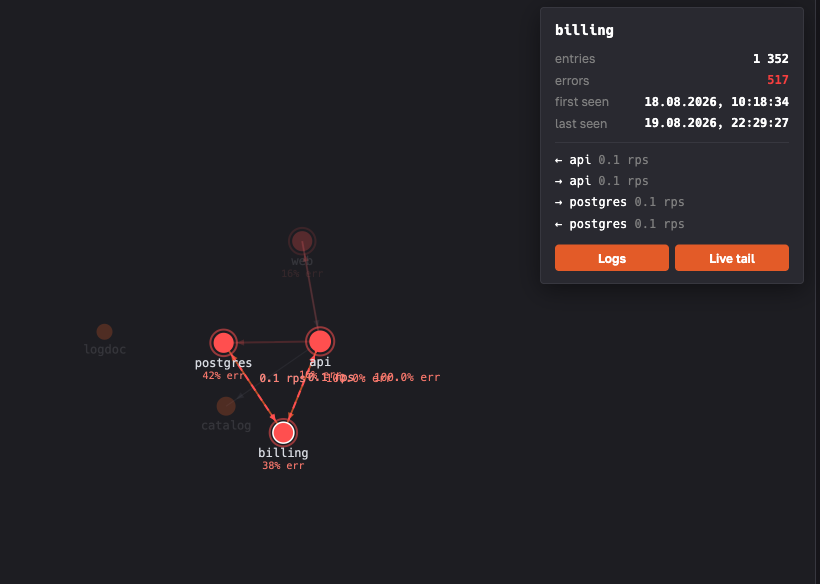
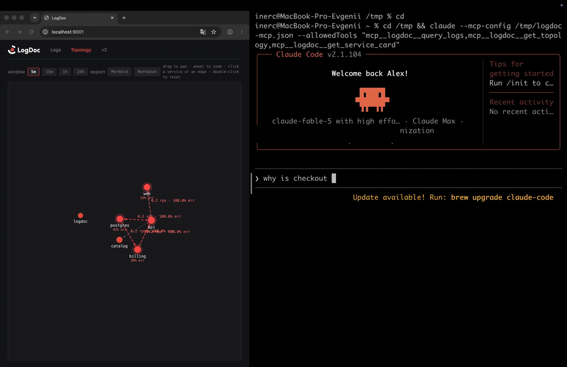

# LogDoc v2

Structured-log-first platform: a single Go binary on top of ClickHouse.
Pipeline: **gather → pipe → sink → view → understand**.



What makes it different:

- **Architecture map from logs alone** — services and their dependencies
  appear on a live map without agents or mandatory tracing;
- **MCP built in** — AI agents investigate your system through the same
  interface you use;
- **v1 protocol compatible** — existing LogDoc appenders keep working.

New here? Start with [docs/getting-started.md](docs/getting-started.md).
Coming from LogDoc v1? See [docs/migration-v1.md](docs/migration-v1.md).

## Quick start

```bash
docker compose -f deploy/docker-compose.yml up -d --build
```

UI: http://localhost:9001 · Health: `GET /healthz`

First log:

```bash
curl -X POST localhost:9001/api/v1/ingest \
  -d '[{"msg":"hello logdoc","app":"demo","lvl":"INFO","fields":{"env":"dev"}}]'
```

Search:

```bash
curl 'localhost:9001/api/v1/query?app=demo&lvl=INFO&q=hello'
```

Live tail: WebSocket `GET /api/v1/tail` (same filter parameters).

v1 compatibility: TCP/UDP `:9999` accepts the `ld_format` protocol —
existing `logdoc-go-appender` and `logback-appenders` work unchanged.

OTLP: gRPC logs on `:4317` — point any OpenTelemetry SDK or Collector at it
(`service.name`→app, body→msg, severity→lvl, attributes→fields).

Syslog: RFC 3164 and RFC 5424 with auto-detection, TCP (newline or
octet-counting framing) and UDP. Off by default — enable with
`LOGDOC_SYSLOG_UDP_ADDR=:5140` / `LOGDOC_SYSLOG_TCP_ADDR=:5140` (or the
`ingest.syslog` section of the config) and point rsyslog, a router or a NAS
at it.

## Architecture map

LogDoc builds a live service map from the logs themselves: shared
`trace_id`/`correlation_id` values and peer fields (`peer.service`, `target`,
`upstream`) turn into directed edges between services. No agents, no tracing
required — traces only refine the map.

- UI: the **Topology** tab — force-directed map, click a service or an edge
  to see its details and jump to its logs.
- API: `GET /api/v1/topology?window=5m` — nodes and edges with windowed
  rates (rps, error rate).
- Export: `GET /api/v1/topology/export?format=mermaid|markdown` — paste the
  current architecture straight into your docs.

## MCP: the agent interface

LogDoc is an MCP server: any agent (Claude Code, or anything speaking MCP
over Streamable HTTP) can investigate your system through three tools —
`query_logs`, `get_topology`, `get_service_card`.

```bash
claude mcp add --transport http logdoc http://localhost:9001/mcp \
  --header "X-API-Key: <your key>"
```

Then ask the agent things like *"why is checkout failing?"* — it walks the
map, follows the error edges and reads the logs itself. Try it on the demo
incident: `deploy/demo-incident.sh` injects a database failure cascading
through three services.



Above (2× speed): a single prompt, no human input — the agent walks the
topology, follows one `trace_id` across four services and lands on the root
cause: a bad `billing` deploy exhausting the postgres connection pool.

## Notifications

Built-in alert rules run over the live stream — no query polling:

- **error_threshold** — N entries with level ≥ ERROR within a sliding window;
- **silence** — a service that used to log stopped logging.

Events go to Telegram, a webhook (JSON POST — the integration point for
everything else) and/or email. Configure in `logdoc.yml`:

```yaml
notify:
  rules:
    - name: billing error burst
      type: error_threshold
      app: billing
      threshold: 10
      window: 1m
    - name: web went silent
      type: silence
      app: web
      window: 5m
  telegram: { token: "...", chat_ids: [123456789] }
  webhook:  { url: "https://example.com/hook" }
```

See `logdoc.example.yml` for every option.

## Development

```bash
make up      # ClickHouse for development (ports 8124/9010)
make ui      # build the frontend (ui/dist, goes into go:embed)
make build   # bin/logdoc
make test
./bin/logdoc # config: flags / env LOGDOC_* / -config logdoc.yml (see logdoc.example.yml)
```

Auth: `LOGDOC_API_KEY` (`X-API-Key` header, `Authorization: Bearer`, or `?api_key=`).
An empty key means dev mode with no auth.

## License

Apache 2.0
